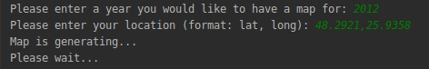
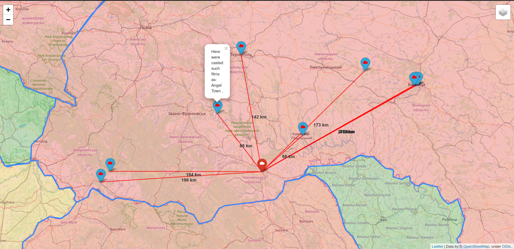
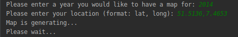
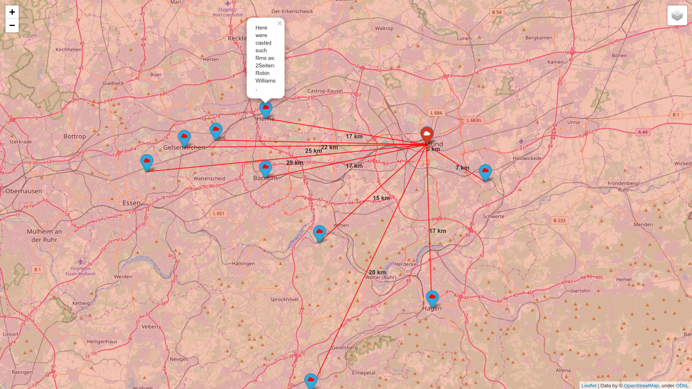

# Movies casted nearby

### This reository is written on Python programming language(Version 3.7+) to help all kinds of people to examine the locations of movies that were casted in a given year and area, better and with ease.

> Two Python modules are used in this repository(geopy and folium), so in order to successfully run the main.py, you need do install them:

```bash
pip3 install geopy

pip3 install folium
```
* The program returns an web file, where are marks of movie locations and their titles, distances to them and country population
* location.list - list of all films and their casting spots from IMDb and world.json(population of multiple countries) are used and required in this repository  
* There is an option to include or exclude some of three layers on the top right panel of an html-page
    1. Layer with markers of 10 or less films nearby in that country or region in that particular year
    2. Layer with the distances to all of those markers
    3. Layer, which reflects the population of all countries and paints them with an appropriate colors

#### Structure of html file that main module returns:
```HTML
<!DOCTYPE html> -- defines which document type is it
<head> -- Different information about the title of map and the map itself
<body> -- the main part of the html-file
<link> -- Makes a link to an external resources
<script> -- Info about script, usually written in Python or JS
<div> -- literally is translated as division (like a block, where we can place parts of an website)
```

### Conclusion:
The information, given by this map could be usefull to almost anybody, but especially useful for Data Scientists or people working in movie creative industry, who want to better analyze the reasons of casting films in special places and how they differ in different counties, or, even, regions. Using third layer, the user can instantly see the corelations between country population and movies casted in it's regions. First layer helps him/her to see the locations where movies were usually casted and the second layer helps to see the exact distance in kilometers. Also, even a lot of people, whose job is not related to movie creating can find it interesting to discover the local filming spots, they weren't ever aware of.

___
### Some xamples:
#### Input: (Chernivtsi, a city in Germany)

#### map.html

#### Input: (Dortmund, a city in Germany)

#### map.html
